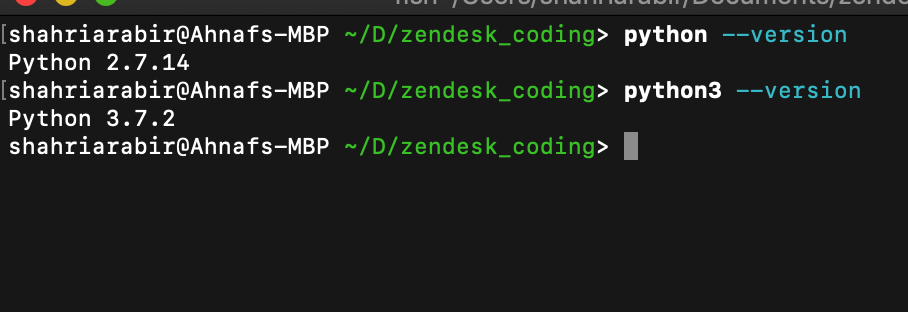
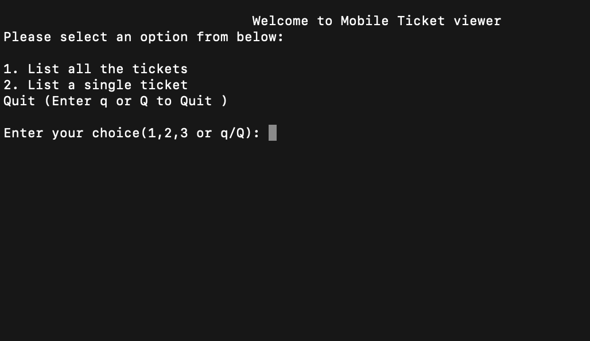

# Zendesk Coding Challenge

The project is about developing a cli (command-line interface) based Mobile Ticket Viewer to display an user's ticket or tickets.

The project runs on python. There are 2 directories given for both python 2.7 and 3.7. Since, there's been a lot of improvements in python 3.7, 
a lot of libraries depreciated (e.g. raw_input in python2 but input in python3 ) and don't support the same way. Please follow the below steps to get the program running.
## Files 

* **code_challenge.py** - This is the main program of ticket viewer. This module has **display_menu** and **menu**
to show menu title and options.

* **tickets.json** - This is the provided json file.

* **credentials.json** - This contains the **subdomain name**, **user email** and **password** as json format.
This can be reconfigured with any other user's credentials to get tickets for different user.

* **get_json.py** - This Class contains methods **get_one_ticket_from_url**, **get_data_from_url** and **check_response**
to get data from url for a single ticket and all the tickets. Check response checks the response returned from the request.


* **tickets.py** - This Class contains  **get_ticket**, **get_all_tickets**, **print_tickets** and **show_ticket**
to get a single ticket, get all the tickets, printing all the tickets and formatting all the tickets respectively.

* **test_code.py** - This Class contains some unittesting for the program. Please note that, there are some module imported twice as per library 'mock' requirement
which pathces only from modules rather than classes.


## Getting Started
These instructions will get you a copy of the project up and running on your local machine for development and testing purposes. 


### Prerequisites

Things you'll need to install before running the program:

* [python 2.7](https://www.python.org/downloads/release/python-2716/) 
### or
* [python 3.7](https://www.python.org/downloads/release/python-373/)

check the python version to verify installation was successful

For python 2
 ```
- python version
 ```
 
 For python 3
 ```
- python3 version
 ```
<p align="center">
  
</p>

 
### Installing
## For python 2.7
## (This procudures are for macOS only!)
After installing python 2.7, please install the following libraries in terminal. 

Update the pip first to latest version.
 ```
pip install --upgrade pip
 ```

Install requests library to get response from the url
 ```
pip install requests
```
Install mock library for unittesting 
```
pip install mock
```

Install requests[security] to resolve the issue with SSLError from requests
```
pip install -U requests[security]
```

## For python 3.7
After installing python 3.7, please install the following libraries. (This procudes are for macOS only!)

Update the pip first to latest version.
 ```
pip3 install --upgrade pip
 ```

Install requests library to get response from the url
 ```
pip3 install requests
```
Install mock library for unittesting 
```
pip3 install mock
```

Install requests[security] to resolve the issue with SSLError from requests
```
pip3 install -U requests[security]
```

## Running Main program
After all those libraries installed, go to relevant directory, either python_v2 or python_v3.

For python 2
```
python code_challenge.py
```

For python 3
```
python3 code_challenge.py
```
This wil show the main menu.

<p align="center">
  
</p>

The program can be also run in executable format.
First, make the program executable
```
chmod +x code_challenge.py 
```
Then 
```
./code_challenge.py
```
to run the main program.

## Running the tests

To run the test, type
```
python test_codes.py
```
or 
```
python3 test_codes.py
```
in python 3

## Author

* **Ahnaf Shahriar Abir** - [Zendesk_coding](https://github.com/AhnafShahriarAbir/zendesk_coding)

### Thank you for Reading me          - Readme.md
